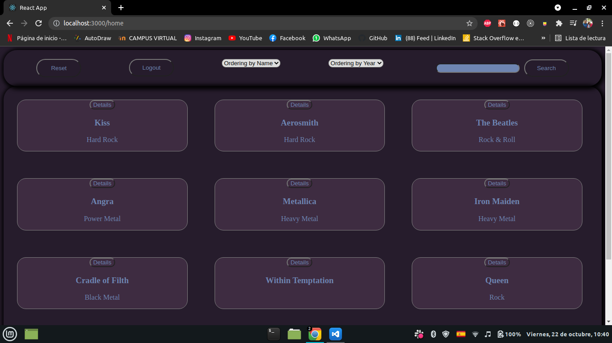
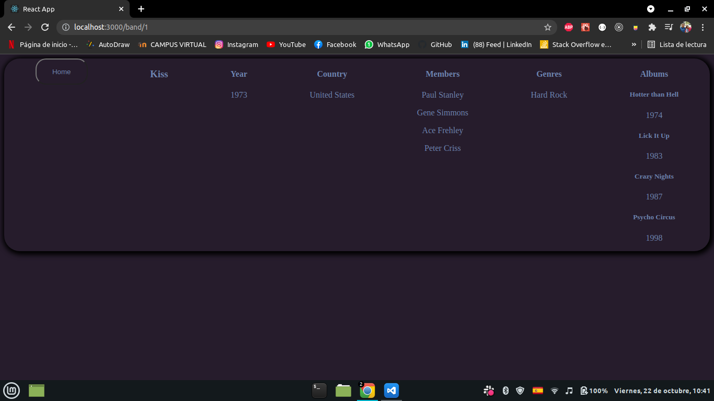

# Improve-in Challenge

_Este proyecto es un challenge de una empresa llamada Improve-in, dedicada a brindar soluciones en Sistemas de Información y Desarrollo de Software a Medida._

## Comenzando 🚀

_Estas instrucciones te permitirán obtener una copia del proyecto en funcionamiento en tu máquina local para propósitos de desarrollo y pruebas._

### Pre-requisitos 📋

_Que cosas necesitas para instalar el software y como instalarlas_

```
Da un ejemplo
```

### Instalación 🔧

_Para la instalación de las dependencias, solo tienes que colocar el siguiente comando en la terminal o consola desde /my-app_

```
npm install
```

_Y para levantar el proyecto, el siguiento comando en la terminal o consola desde /my-app_

```
npm start
```

## Algunas capturas del proyecto

_Login_

_Home_

_Details_


## Construido con 🛠️

- [JavaScript](https://developer.mozilla.org/es/docs/Web/JavaScript)
- [CSS](https://developer.mozilla.org/es/docs/Web/CSS)
- [ReactJs](https://reactjs.org/docs/getting-started.html)
- [Redux](https://es.redux.js.org/)
- [Axios](https://axios-http.com/docs/intro)

## Autor ✒️

- **Marco Galván** - [GitHub](https://github.com/elmacro1)
