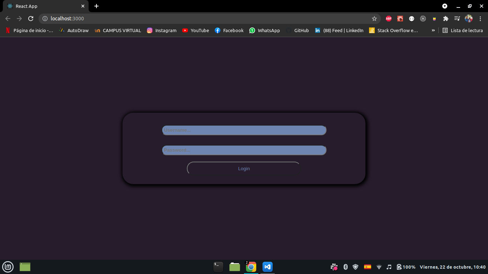

# Improve-in Challenge

_This project is a challenge for a company called Improve-in, dedicated to providing solutions in Information Systems and Custom Software Development._

## Starting 🚀

_These instructions will allow you to get a copy of the project running on your local machine for development and testing purposes. In your terminal put the following command._

```
git clone *repo link*
```

### Installation 🔧

_To install the dependencies, you just have to place the following command in the terminal or console from / my-app_

```
npm install
```

_And to raise the project, the following command in the terminal or console from / my-app_

```
npm start
```

## Some screenshots of the project

_Login_

_Home_

_Details_


## Built with 🛠️

- [HTML5](https://developer.mozilla.org/es/docs/Web/HTML)
- [CSS3](https://developer.mozilla.org/es/docs/Web/CSS)
- [JavaScript](https://developer.mozilla.org/es/docs/Web/JavaScript)
- [ReactJs](https://reactjs.org/docs/getting-started.html)
- [Redux](https://es.redux.js.org/)
- [Axios](https://axios-http.com/docs/intro)

## Author ✒️

- **Marco Galván** - [GitHub](https://github.com/elmacro1)
